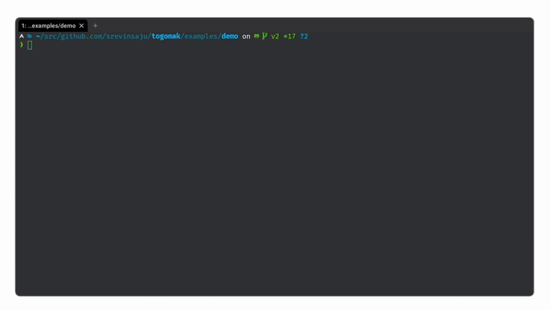

# togomak 


[](https://codecov.io/github/srevinsaju/togomak)

togomak is a powerful, build pipeline orchestration tool, and a drop-in 
replacement for your CI/CD execution environment that could run anywhere. 




`togomak` is inspired from Terraform lifecycle for infrastructure as code (IaC) 
to create a context free, concurrent pipeline evaluation and orchestration engine
to simplify your local builds and your CI/CD pipelines. 

> looking for `togomak v0`? Check [here][v0]


Okay, enough talk, let's see some code.

## Getting Started

`togomak` uses [HCL (Hashicorp Language)][hcl] to define pipelines 
declaratively. If you are already familiar with Terraform, this becomes
a piece of cake. 

Here is a sample `togomak.hcl` file:
```hcl 
togomak {
  version = 2
}

data "prompt" "repo_name" {
  prompt = "enter repo name: "
  default = "username/repo"
}

locals {
  repo = "srevinsaju/togomak"
  lint_tools = ["misspell", "golangci-lint", "abcgo"]
  build_types = ["amd64", "i386", "arm64"]
}

stage "lint" {
  script = <<-EOT
  echo 💅 running style checks for repo ${local.repo}
  %{ for tool in local.lint_tools }
  echo "* running linter: ${tool}"
  sleep 1
  %{ endfor }
  EOT
}


stage "build" {
  script = <<-EOT
  echo 👷 running ${ansifmt("green", "build")}
  %{ for arch in local.build_types }
  echo "* building ${local.repo} for ${arch}..."
  sleep 1
  %{ endfor }
  EOT
}

stage "deploy" {
  if = data.prompt.repo_name.value == "srevinsaju/togomak"
  depends_on = [stage.build]
  container {
    image = "hashicorp/terraform"
  }
  args = ["version"]
}
```

simple, isn't it?

### Documentation
* Head over to our [documentation page](https://togomak.srev.in). 
* Check out the [examples](./examples) directory for examples
* Check out the [tests](./tests/tests) directory for even bizarre examples.

### Features (in a nutshell)
* Declarative pipeline definition
* HCL based configuration
* Native dependency resolution
* Concurrency
* Plugins (wip, [use v0][v0] for plugin support)
* Macros (reusable stages)
* Terraform-like data sources

## Installation 
Check out the [releases](https://github.com/srevinsaju/togomak/releases) page
for the `v2.0.0-alpha.*` release binaries, and other pre-built packages for your 
desired platform.

### Building from Source
```bash
cd cmd/togomak 
go build
```
### Building using `togomak` (what!)
```bash 
togomak
```

## Contributing
Contributions are welcome, and encouraged. Please check out the
[contributing](./docs/src/contributing.md) guide for more information.

## License
`togomak` is licensed under the [MPL License v2.0](LICENSE)

[hcl]: https://github.com/hashicorp/hcl
[v0]: https://github.com/srevinsaju/togomak/tree/main


