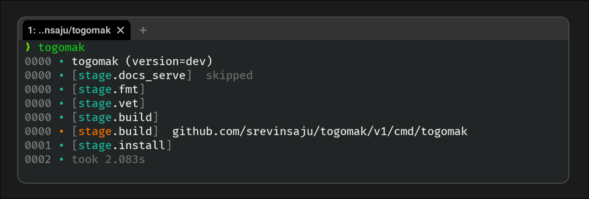
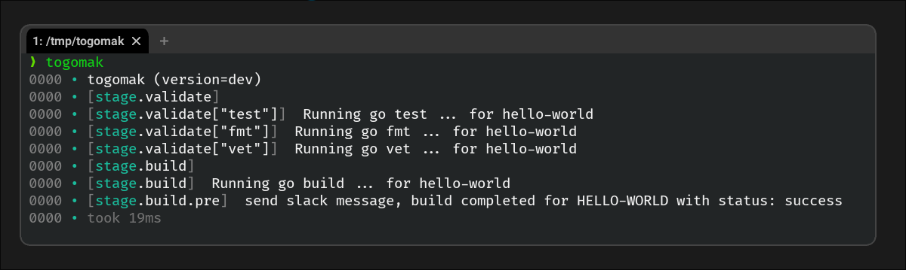

# togomak 


[](https://codecov.io/github/srevinsaju/togomak)



togomak is a declarative pipeline orchestration tool, powered by [HashiCorp Configuration Language (HCL)][hcl]
built on top of Terraform's architecture and features. It supports modules, custom HCL expressions.

```hcl 
togomak {
  version = 2
}
stage "hello" {
  script = "echo hello world"
}
```

```ansi
$ togomak
0000 • togomak (version=dev)
0000 • [stage.hello]  hello world
0000 • took 2ms
```


## Contents 
* [Installation](#installation)
* [Getting Started](#getting-started)
* [Features](#features)
* [Using modules](#modules)
* [Documentation (wip)](https://togomak.srev.in)
* [Examples](./examples)

## Installation
Download a compatible binary for your operating system and architecture from [Releases](https://github.com/srevinsaju/togomak/releases).
The `v2.x` tag has the latest, bleeding edge features which are more relevant. 

Or, using `go`:
```bash
go install github.com/srevinsaju/togomak/v2@latest
```

### Building and installing from source 
1. Clone the repository, https://github.com/srevinsaju/togomak
2. ```bash
   cd cmd/togomak
   go build .
   ./togomak
   ```

### Docker containers 
Consider using the `ghcr.io/srevinsaju/togomak:v2alpine` image. Other flavors are available are available [here](https://github.com/srevinsaju/togomak/pkgs/container/togomak).

## Getting Started

```hcl 
togomak {
  version = 2
}

locals {
  validate = toset(["vet", "fmt", "test"])
}

variable "service" {
  type = string
  description = "Name of the service"
}

stage "build" {
  depends_on = [stage.validate]
  script = "echo Running go build ... for ${var.service}"
  post_hook {
    stage {
      script = "echo send slack message, build completed for ${upper(var.service)} with status: ${this.status}"
    }
  }
}

stage "validate" {
  for_each = local.validate
  script = "echo Running go ${each.value} ... for ${var.service}"
}
```




## Installation 
Check out the [releases](https://github.com/srevinsaju/togomak/releases) page
for the `v2.0.0-alpha.*` release binaries, and other pre-built packages for your 
desired platform.

### Building from Source
```bash
cd cmd/togomak 
go build
```
### Building using `togomak` (what!)
```bash 
togomak
```

## Features
In `togomak`, a `stage` is a single independent task, and a `module` is a group of stages. 
Here is a non-exhaustive list of features. See the [work in progress documentation](https://togomak.srev.in) or [examples](./examples) for a list of examples. 
These examples also run as part of an integration test, using [tests/togomak.hcl](./tests/togomak.chl). 

* **Concurrency**: All stages and modules run in parallel by default. 
* [**Modular**](https://togomak.srev.in/docs/schema/module): Create reusable parts of your CI/CD pipeline and use them from `git`, `https`, `s3` buckets or `gcs` buckets.
  ```hcl
  # modules/togomak.hcl
  ...
  variable "name" {
    type = string
    description = "Name of person"
  }
  stage "hello" {
    script = "echo ${var.name}"
  }
  ```
  ```hcl
  # togomak.hcl
  ...
  module {
    source = "./modules"
    name = "srev"
  }
  ``` 
* [**Conditional**](https://togomak.srev.in/docs/schema/stage/arguments/meta#if): Run stages or modules by specifying a HCL expression in `if` meta-arguments.
  ```hcl
  stage "hello" {
    if = env("USER") == "builder"
    ...
  }
  ```
* **Built on top of Terraform's Architecture**: supports most of Terraform's functions, block types, language, syntax and expression, keeping it a low learning curve for new and experienced users alike. Supports many familiar features like
  - `local.<name>` and [`locals {}`]( https://togomak.srev.in/docs/schema/locals)
  - `var.<name>` and [`variable {}`](https://togomak.srev.in/docs/schema/variables)
  - Functions like `sum()`, `flatten()`, `toset()`, `upper()`, `fileset()`, `setunion()` and [so on](https://togomak.srev.in/docs/language/functions/abs)
  - [`for_each`](https://togomak.srev.in/tutorial/creating-your-first-module#-congratulations) to iterate over a `local`, `var` to perform a `stage` or a `module` over different configurations. 
* **[Lifecycles](https://togomak.srev.in/docs/language/meta-arguments/lifecycles) and [Rule Engine](https://togomak.srev.in/docs/cli/usage)**: Configure how your pipeline behaves when you type `togomak deploy` or `togomak build`, or when you would like to allow-list a specific stage with `togomak deploy +stage.some_stage` and block a specific stage with `togomak build ^stage.slack_hook`. See [Usage](https://togomak.srev.in/docs/cli/usage) on how togomak uses them.
  ```
  ❯ togomak
  0000 • togomak (version=dev)
  0000 • [stage.alice]
  0000 • [stage.bob]  skipped
  0000 • [stage.eve]
  0000 • [stage.eve]  hello im default
  0000 • [stage.alice]  hello im default, deploy
  0000 • took 2ms
  ❯ togomak deploy
  0000 • togomak (version=dev)
  0000 • [stage.alice]
  0000 • [stage.bob]
  0000 • [stage.eve]  skipped
  0000 • [stage.bob]  hello im deploy
  0000 • [stage.alice]  hello im default, deploy
  0000 • took 2ms
  ❯ togomak all
  0000 • togomak (version=dev)
  0000 • [stage.bob]
  0000 • [stage.eve]
  0000 • [stage.alice]
  0000 • [stage.eve]  hello im default
  0000 • [stage.alice]  hello im default, deploy
  0000 • [stage.bob]  hello im deploy
  0000 • took 2ms
  ```
* [**Pre and Post Hooks**](https://togomak.srev.in/docs/schema/stage/arguments/hooks#pre_hook): Runs commands or modules before and after the execution of a [stage](./examples/hooks) as well as an [entire pipeline](./examples/pre-post).
* **Query Engine**: Pass custom `hcl` expressions to togomak to choose which stages can run, and which cannot using the `--query` parameter on the command line.
* Comprehensive terraform-like error diagnostics with references to contents of the file where the error originates from.
* [**Terraform Support**](https://togomak.srev.in/docs/schema/data/providers/built-in/tf): Use terraform `data` blocks (or `resource`) blocks as data sources in your CI/CD pipeline. See [examples/terraform](./examples/terraform) for an example.

And don't forget to format your CICD files with `togomak fmt`.

## Contributing
Contributions are welcome, and encouraged. Please check out the
[contributing](./docs/src/contributing.md) guide for more information.

## License
`togomak` is licensed under the [MPL License v2.0](LICENSE)

[hcl]: https://github.com/hashicorp/hcl
[v0]: https://github.com/srevinsaju/togomak/tree/main
